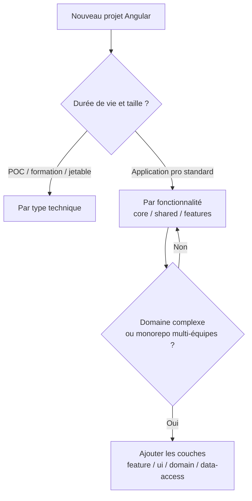

# Architecturer un projet Angular

> **Public visé** : développeuses et développeurs connaissant déjà Angular.
> **Objectif** : comparer les grandes stratégies d'architecture d'un projet Angular, comprendre leurs compromis, et savoir choisir celle qui convient à un contexte donné (taille d'équipe, durée de vie du produit, contraintes métier).

---

## 1. Pourquoi parler d'architecture ?

Angular est un framework **opiniâtre** : il impose déjà beaucoup de choses (composants, injection de dépendances, routing, réactivité). Pourtant, il laisse une question ouverte et lourde de conséquences : **comment organiser les dossiers, les responsabilités et les dépendances ?**

Une bonne architecture n'est pas un but esthétique. Elle répond à des besoins concrets :

- **Trouver rapidement** où se trouve un bout de code.
- **Limiter l'impact d'un changement** (modifier une fonctionnalité sans casser les autres).
- **Permettre à plusieurs personnes** de travailler en parallèle sans se marcher dessus.
- **Faciliter les tests** et le remplacement de composants techniques.
- **Contrôler le poids** des bundles livrés au navigateur (lazy loading).

> **Règle directrice** : l'architecture doit rendre les changements **fréquents faciles** et les changements **rares possibles**.

---

## 2. Les principes transverses (valables quelle que soit l'approche)

Avant de comparer les organisations de dossiers, posons les principes qui les sous-tendent.

### a) Séparation des responsabilités (SoC)

On distingue trois grandes familles de code :

| Couche | Rôle | Exemples |
|--------|------|----------|
| **Présentation** | Afficher et capter les interactions | Composants, templates, directives |
| **Logique métier / état** | Décider, orchestrer, conserver l'état | Services, stores (signals, NgRx) |
| **Accès aux données** | Parler au monde extérieur | Services HTTP, repositories, mappers |

### b) Le sens des dépendances

Une architecture saine impose un **sens unique** aux dépendances :

```
Présentation  ──►  Logique métier  ──►  Accès aux données
```

La couche de présentation ne doit **jamais** être importée par la couche de données. Ce principe (proche de la *Clean Architecture*) protège le cœur métier des détails techniques.

### c) Composants « intelligents » vs « présentation »

- **Smart / Container** : injectent des services, gèrent l'état, orchestrent.
- **Dumb / Presentational** : reçoivent des `input()`, émettent des `output()`, ne connaissent aucun service.

Ce découpage améliore la testabilité et la réutilisation.

### d) Cohésion et couplage

- **Forte cohésion** : ce qui change ensemble vit ensemble.
- **Faible couplage** : les modules se connaissent le moins possible (via des interfaces, pas des implémentations).

---

## 3. Les grandes stratégies d'organisation

Il existe principalement **trois** manières d'organiser l'arborescence d'un projet Angular. Elles ne s'excluent pas totalement : les projets matures combinent souvent la 2 et la 3.

### 3.1 Organisation « par type technique » (layer-by-type)

On regroupe les fichiers selon **ce qu'ils sont**.

```
src/app/
├── components/
│   ├── produit-list/
│   ├── produit-add-form/
│   └── header/
├── services/
│   ├── product-service.ts
│   └── preference-service.ts
├── models/
│   ├── IProduct.ts
│   └── IUtilisateur.ts
├── pipes/
├── validators/
└── guards/
```

> C'est l'organisation de **ce projet de formation** — parfaite pour apprendre, car chaque concept a son tiroir.

**Avantages**
- Très simple à comprendre, idéal en apprentissage et sur les petits projets.
- On sait immédiatement où ranger « un service » ou « un pipe ».

**Inconvénients**
- Une seule fonctionnalité est **éparpillée** dans plusieurs dossiers.
- Ne passe pas bien à l'échelle : à 200 composants, le dossier `components/` devient illisible.
- Encourage le couplage : tout le monde peut tout importer.

**Quand la choisir ?** Prototypes, POC, projets pédagogiques, très petites applications.

---

### 3.2 Organisation « par fonctionnalité » (feature-based)

On regroupe les fichiers selon **ce à quoi ils servent** métier. C'est aujourd'hui l'approche **recommandée par défaut**.

```
src/app/
├── core/                  # Singletons, chargés une seule fois
│   ├── services/
│   ├── interceptors/
│   └── guards/
├── shared/                # Réutilisable, sans état, sans dépendance métier
│   ├── components/
│   ├── pipes/
│   └── directives/
└── features/              # Une fonctionnalité = un dossier autonome
    ├── produits/
    │   ├── produit-list/
    │   ├── produit-add-form/
    │   ├── services/
    │   ├── models/
    │   └── produits.routes.ts
    └── utilisateurs/
        ├── utilisateur-add-form/
        ├── services/
        └── utilisateurs.routes.ts
```

Trois zones apparaissent, c'est le cœur du modèle :

| Dossier | Contenu | Règle d'or |
|---------|---------|------------|
| **`core/`** | Services singletons, intercepteurs, garde d'authentification | Importé **une seule fois** au démarrage |
| **`shared/`** | Briques réutilisables **sans logique métier** (boutons, pipes, directives) | Ne dépend d'**aucune** feature |
| **`features/`** | Le métier, découpé par domaine | Une feature ignore les autres features |

**Avantages**
- **Forte cohésion** : tout ce qui concerne « produits » est au même endroit.
- **Lazy loading naturel** : chaque feature possède ses propres routes et se charge à la demande.
- Facilite le travail en équipe : une équipe = une feature.
- Supprimer une fonctionnalité = supprimer un dossier.

**Inconvénients**
- Nécessite de la **discipline** sur les frontières (ne pas importer une feature depuis une autre).
- La distinction `shared` / `core` / `feature` demande un peu d'expérience.

**Quand la choisir ?** La majorité des applications professionnelles, du petit au grand projet.

---

### 3.3 Architecture en couches / Clean Architecture (par domaine)

On pousse la séparation plus loin : à l'intérieur de chaque feature, on isole explicitement les **couches**. Popularisée par des approches comme *Nx*, *DDD* (Domain-Driven Design) et la *Clean Architecture*.

```
features/produits/
├── feature/          # Composants « smart », routes, orchestration UI
├── ui/               # Composants « dumb » de présentation
├── domain/           # Modèles, logique métier, état (stores)
│   ├── models/
│   ├── store/
│   └── services/     # Cas d'usage (use-cases)
└── data-access/      # Appels HTTP, mappers, DTO
```

Chaque couche a un rôle strict et un **sens de dépendance imposé** :

```
feature ──► ui ──► domain ◄── data-access
```

**Avantages**
- Frontières **explicites et vérifiables** (avec Nx, on peut interdire techniquement les imports interdits).
- Cœur métier (`domain`) **totalement indépendant** d'Angular et du réseau → tests unitaires triviaux.
- Idéal pour les **grosses équipes** et les **monorepos** longue durée.

**Inconvénients**
- **Verbeux** : beaucoup de fichiers et d'indirections pour une petite fonctionnalité.
- Sur-dimensionné pour une application simple (over-engineering).
- Courbe d'apprentissage réelle pour l'équipe.

**Quand la choisir ?** Grandes applications, monorepos, domaines métier complexes et durables, équipes multiples.

---

## 4. Tableau de synthèse

| Critère | Par type (3.1) | Par fonctionnalité (3.2) | En couches / Clean (3.3) |
|---------|:--------------:|:------------------------:|:------------------------:|
| Courbe d'apprentissage | facile | modérée | élevée |
| Passage à l'échelle | faible | bon | excellent |
| Lazy loading | difficile | naturel | naturel |
| Travail en équipe | limité | bon | excellent |
| Risque d'over-engineering | faible | faible | élevé si petit projet |
| Cas typique | POC, formation | apps pro courantes | monorepo, DDD |

---

## 5. Les briques Angular au service de l'architecture

L'architecture ne tient pas qu'aux dossiers : Angular fournit des mécanismes concrets pour matérialiser les frontières.

### a) Composants standalone (le standard depuis Angular 15+)

Les `NgModule` ne sont plus nécessaires. Chaque composant déclare ses propres dépendances via `imports`. L'architecture repose désormais sur les **dossiers et les routes**, plus sur les modules.

```typescript
@Component({
  selector: 'app-produit-list',
  imports: [ProduitCard, MatButtonModule],
  templateUrl: './produit-list.html',
})
export class ProduitList {}
```

### b) Le lazy loading par les routes

C'est le levier de performance majeur : ne charger le code d'une feature que lorsqu'on y navigue.

```typescript
// app.routes.ts
export const routes: Routes = [
  {
    path: 'produits',
    loadChildren: () =>
      import('./features/produits/produits.routes').then((m) => m.PRODUITS_ROUTES),
  },
];
```

### c) L'injection de dépendances comme frontière

`inject()` et les tokens permettent de dépendre d'une **abstraction** plutôt que d'une implémentation. C'est ainsi qu'on remplace un vrai service HTTP par un `MockProductService` en test.

```typescript
export class ProduitList {
  private _service = inject(ProductService); // abstraction injectée
}
```

### d) La gestion d'état

Selon la complexité :

- **Local** : `signal()` / `computed()` dans le composant.
- **Partagé simple** : un service `@Injectable` exposant des signals.
- **Complexe** : un store dédié (NgRx SignalStore, etc.) dans la couche `domain`.

---

## 6. Erreurs fréquentes à éviter

- **Le dossier `shared/` fourre-tout** : il finit par tout contenir. Règle : `shared` ne doit contenir **aucune logique métier**.
- **Les dépendances croisées entre features** : `produits` qui importe `utilisateurs`. Si un besoin commun émerge, il remonte dans `shared` ou `core`.
- **Sur-architecturer trop tôt** : appliquer la Clean Architecture sur une app de 5 écrans. Commencez simple, refactorez quand la douleur apparaît.
- **Composants « dieux »** : un composant qui fait l'appel HTTP, la validation, l'affichage et la navigation. Séparez smart / dumb.
- **Ignorer le lazy loading** : tout charger au démarrage alourdit le premier rendu.

---

## 7. Comment choisir ? Un arbre de décision



> **Conseil pratique** : démarrez presque toujours en **feature-based** (3.2). C'est le meilleur rapport bénéfice/effort. Faites évoluer vers les couches (3.3) **feature par feature**, uniquement là où la complexité le justifie.

---

## 8. À retenir

- L'architecture sert à maîtriser le **changement**, pas à faire joli.
- Trois grandes stratégies : **par type**, **par fonctionnalité**, **en couches**.
- Le **feature-based** (`core` / `shared` / `features`) est le choix par défaut recommandé.
- Respectez le **sens des dépendances** et la distinction **smart / dumb**.
- Les outils Angular (standalone, lazy loading, DI, signals) sont les leviers concrets qui matérialisent ces frontières.
- **Commencez simple**, refactorez quand la douleur devient réelle : évitez l'over-engineering.

---

## 9. Pour aller plus loin (pistes d'atelier)

1. **Refactoring guidé** : partez de l'organisation « par type » de ce projet et regroupez tout le domaine « produits » dans une feature autonome avec ses propres routes en lazy loading.
2. **Frontières explicites** : identifiez, dans le code existant, un import qui viole le sens des dépendances et proposez une correction.
3. **Smart vs Dumb** : prenez un composant existant qui mélange appel de service et affichage, et scindez-le en un container et un composant de présentation.
4. **Mesure d'impact** : activez le lazy loading sur une route et observez la différence de taille du bundle initial (`ng build` + analyse).

